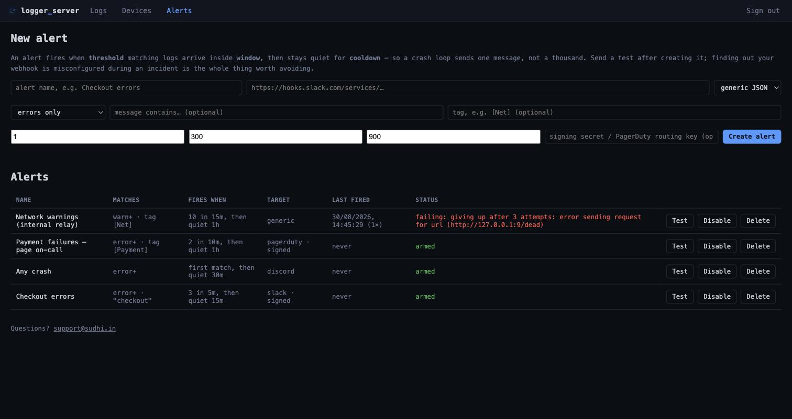

# Alerting

A log server nobody is watching at 3am is a log server that tells you nothing.
Alert rules watch the stream for you and post to a webhook when something
matches.



## How a rule fires

Three numbers, and they matter:

| | |
|---|---|
| **threshold** | How many matching logs it takes |
| **window** | The period they have to arrive in |
| **cooldown** | How long the rule stays quiet after firing |

> *"3 errors in 5 minutes, then quiet for 15 minutes."*

The cooldown is the part people skip and regret. A crash loop produces
thousands of identical errors in seconds; without a cooldown that is thousands
of webhook calls, a rate-limited Slack channel, and a team that mutes the
channel. With one, it is a single message. There is a test asserting that 200
errors inside the cooldown produce exactly one alert.

Set `threshold: 1` if you want to hear about the very first occurrence, and keep
a cooldown so the second thousand stay quiet.

## Creating one

From the **Alerts** page in the dashboard, or over the API:

```sh
curl -X POST "$URL/api/v1/alerts" \
  -H "x-admin-token: $ADMIN" \
  -H 'content-type: application/json' \
  -d '{
        "name": "Checkout errors",
        "url": "https://hooks.slack.com/services/T00/B00/xxx",
        "format": "slack",
        "min_level": 4,
        "contains": "checkout",
        "threshold": 3,
        "window_secs": 300,
        "cooldown_secs": 900
      }'
```

### What a rule can match on

| Field | Default | Meaning |
|---|---|---|
| `min_level` | `4` (error) | Minimum severity |
| `contains` | any | Case-insensitive substring of the message |
| `name_filter` | any | Exact tag, e.g. `[Net] ` |
| `device_id` | any | Restrict to one device |

All of them are ANDed. A rule with no filters beyond `min_level` fires on any
error from anywhere, which is a perfectly reasonable place to start.

## Where it delivers

`format` picks the shape of the body:

| Format | For |
|---|---|
| `generic` | Our own documented JSON. Point it at anything |
| `slack` | Slack incoming webhooks — blocks, with the log in a code block |
| `discord` | Discord webhooks — an embed coloured by severity |
| `pagerduty` | PagerDuty Events API v2, for waking someone up |

### Generic payload

```json
{
  "rule":   { "id": 1, "name": "Checkout errors" },
  "summary": "Checkout errors — 3 matches in 300s",
  "count": 3,
  "window_seconds": 300,
  "fired_at": 1788075947856,
  "origin": "https://logs.example.com",
  "trigger": {
    "id": 4821, "ts": 1788075947856, "name": "[Net] ", "level": 4,
    "message": "POST /checkout txn_9f21ab -> 500 Internal Server Error",
    "device_id": 3, "device": "Pixel 8 Pro — Priya (QA)",
    "context": { "session": "s-42", "appVersion": "3.1.0" }
  }
}
```

`trigger` is the log line that tipped the rule over, not a summary of all of
them — usually the one you want to read.

Set `LOGGER_PUBLIC_URL` so `origin` links back to a dashboard people can
actually open.

### PagerDuty

`secret` carries the **routing key** for this format, and goes in the body
where PagerDuty expects it rather than in a signature header. `dedup_key` is
derived from the rule id, so repeat firings group into one incident instead of
paging someone repeatedly.

## Verifying it came from you

Set `secret` on a rule and every delivery carries:

```
x-logger-signature: sha256=<hex>
```

an HMAC-SHA256 of the request body. Verify it against **the raw bytes you
received** — re-serialising the JSON first will produce a different signature,
because key order and spacing are part of what was signed.

```python
import hmac, hashlib
expected = "sha256=" + hmac.new(SECRET.encode(), raw_body, hashlib.sha256).hexdigest()
assert hmac.compare_digest(expected, request.headers["x-logger-signature"])
```

The secret is write-only: creating or listing a rule tells you whether one is
set, never what it is.

## Test it before you need it

Every rule has a **Test** button, and an endpoint behind it:

```sh
curl -X POST "$URL/api/v1/alerts/1/test" -H "x-admin-token: $ADMIN"
```

It delivers a synthetic alert down the real path, ignoring threshold and
cooldown. Do this when you create the rule. The alternative is discovering your
webhook URL had a typo during the incident it was meant to catch.

The Alerts page then shows the result: **armed**, **delivering**, or **failing**
with the actual error. A webhook that has been quietly failing for a month looks
identical to one that has had nothing to report, which is exactly why that
column exists.

## Delivery behaviour

- **Timeout** 10 seconds; **3 attempts** with exponential backoff.
- A `4xx` other than `429` is not retried — a bad URL will be equally bad in
  600 ms.
- Delivery runs on its own task, draining a bounded queue. If the queue fills
  because an endpoint is hanging, new alerts are **dropped rather than queued**,
  because slowing down log ingestion to deliver a notification would be a worse
  failure than missing one.
- Nothing about alerting is on the ingest hot path beyond a level comparison.

## Outbound safety

A webhook URL is an instruction to make a request from inside your network. By
default the server refuses to deliver to:

- loopback (`127.0.0.1`, `::1`)
- private ranges (`10/8`, `172.16/12`, `192.168/16`)
- link-local, **including `169.254.169.254`** — the cloud metadata endpoint
- unique-local IPv6, carrier-grade NAT, and IPv4-mapped forms of all the above

Hostnames are resolved and **every** address they answer with is checked, and
the check runs again immediately before each delivery, because DNS can change
its answer between saving a rule and sending to it.

This matters more than it looks. Rules are admin-created, and on a deployment
where an AI agent holds admin, the URL is not necessarily written by a human.
Without the guard, "create an alert pointing at `http://169.254.169.254/`" turns
your alerting system into a credential reader.

For an internal relay, opt out deliberately:

```sh
LOGGER_WEBHOOK_ALLOW_PRIVATE=true
```

That relaxes the address rules only. `file://`, `gopher://` and malformed URLs
stay rejected either way.

## Alerts and AI agents

An agent can **read** your alert rules — useful for "would we have been told
about this?" and for spotting a webhook that has been failing silently.

It cannot create or delete them, at any access level. Creating a rule means
handing the server a URL it will POST your log contents to, so a log line
crafted to read like an instruction could otherwise talk an agent into
exfiltrating logs to an address an attacker controls. The outbound guard stops
internal probing but cannot help with that, so rule creation stays a human
action.

## What it costs

Alerting needs a TLS stack for outbound HTTPS. That cost about 5 MB of image
when it landed, but 3.3.0 recovered it — see
[architecture.md](architecture.md#where-the-size-went). The client is now built
on the first delivery rather than at startup, so a server with no alert rules
does not pay for the root certificate store at all.

Nothing about alerting touches the ingest hot path beyond a level comparison.

## Settings

| Variable | Default | What it does |
|---|---|---|
| `LOGGER_WEBHOOK_ALLOW_PRIVATE` | `false` | Allow webhooks to private and loopback addresses |
| `LOGGER_PUBLIC_URL` | `http://localhost:PORT` | The dashboard link included in alerts |
| `LOGGER_ALERT_QUEUE` | `256` | Pending deliveries before new alerts are dropped |

`logger_alert_rules_active` in [`/metrics`](api.md#operations) reports how many
rules are enabled — worth an alarm of its own if it ever reads zero.
