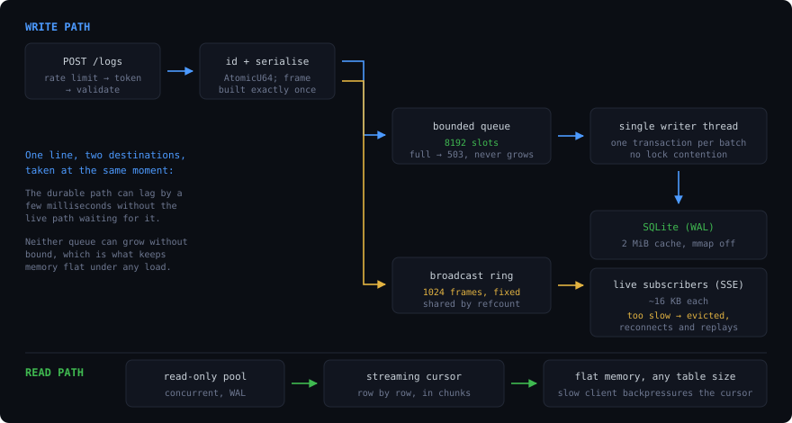

# Architecture

How the server is built, and why. Worth reading if you are changing it, or
deciding whether to trust it with something.

## Shape



The same thing as text, if you prefer it:

```
  POST /api/v1/logs ─▶ rate limit ─▶ device token ─▶ validate ─▶ id from AtomicU64
                                                          │
                                        ┌─────────────────┴─────────────────┐
                                        ▼                                   ▼
                              bounded queue (8192)              broadcast ring (1024)
                                        │                                   │
                                        ▼                                   ▼
                              single writer thread                 live SSE clients
                              batched transaction               lagging client evicted
                                        │
                                        ▼
                                   SQLite (WAL)
                                        ▲
                                        │
  GET queries ──────────────────────────┴── read-only pool, streaming cursor
```

## The three ideas that produce the memory numbers

**Serialize once, share by reference count.** Each log line is turned into its
wire frame exactly once and put into a broadcast channel as a refcounted buffer.
A thousand connected dashboards cost a thousand pointer copies, not a thousand
JSON encodings. Fan-out is O(1) in allocation.

**Every queue is bounded.** The broadcast ring is fixed at 1024 frames; a
subscriber that falls behind is disconnected rather than buffered for, and
reconnects with `Last-Event-ID` to replay the gap from disk. The ingest queue is
bounded at 8192; when it fills, writes are refused with `503` instead of growing.
There is no unbounded buffer anywhere on either path, which is what makes the
memory ceiling independent of load.

**Result sets are never materialised.** The export endpoint steps a SQLite
cursor and pushes fixed-size chunks into a small channel. Because that channel
is bounded, a slow HTTP client backpressures the cursor rather than filling
memory. Exporting fifty million rows costs the same memory as exporting a
thousand.

What memory *does* scale with is connection count, at roughly 16 KB per open
stream — HTTP per-connection read and write buffers plus a task, not per-client
log buffering.

## Writes

One dedicated thread owns the only read-write connection. It blocks for the
first item, drains whatever else has queued behind it, and commits the lot in a
single transaction against a cached prepared statement.

Two consequences worth naming:

- **No write contention and no `SQLITE_BUSY`.** There is exactly one writer, by
  construction.
- **Batching costs nothing at low load.** Because the thread commits as soon as
  it wakes, a lone log line is written immediately; batches only form when
  traffic actually warrants them. A fixed flush timer would have added latency
  to the quiet case for no benefit.

The loop uses a 100 ms receive timeout rather than an unbounded block, so the
retention sweep still runs on an idle server and shutdown is noticed promptly.

### Ids

Ids come from an `AtomicU64` seeded at boot from `MAX(id)`, not from SQLite
`AUTOINCREMENT`. That is what lets ingest return an id before the row is durable,
and it keeps ids monotonic even as retention deletes from the tail — which
rowid reuse would not.

### Durability

`POST` returns `202` once the line is queued and broadcast; it lands on disk a
few milliseconds later. `?sync=true` waits for the commit and returns `201`.

The honest trade: a crash in that window loses the queued lines. For a debugging
log sink that is the right call — the alternative is an fsync per line, roughly
two orders of magnitude slower. `SIGTERM` is handled gracefully and flushes the
queue, so ordinary restarts and redeploys lose nothing.

## Reads

A small pool of read-only connections, used from blocking tasks. WAL mode lets
them run concurrently with the writer.

Exports get a *separate* connection and their own concurrency limit rather than
taking from the pool, because an export can run for minutes and must not starve
the fast-path queries behind it.

## Authentication


Writes are authenticated on every request, so authentication must not touch the
database — a lookup per log line would collapse the ingest path. The token
digest to device map lives in memory, loaded at boot and written through on
create and revoke. SQLite stays the source of truth; the map is a cache that is
never stale.

That design has a pleasant consequence: revocation takes effect on the very next
request, not at some later cache refresh.

Tokens are stored only as a SHA-256 hash. A plain digest is correct here — a
token is 180+ bits of OS randomness, so unlike a low-entropy password there is
nothing for a slow KDF to defend. `last_seen` is accumulated in memory and
flushed by the writer thread on its retention tick, so activity tracking does
not add a database write per log line.

Device attribution comes from the authenticating token and never from the
request body, so one device cannot write logs as another.

## Retention

Runs on the writer thread every 10 seconds: an age cap, then a row cap enforced
as a range delete against the primary key rather than a scan, then a WAL
checkpoint — because deletes only grow the write-ahead log until it is
checkpointed.

## Memory tuning

`SQLite` is pinned to a 2 MiB page cache with memory-mapping disabled, so
resident memory is deterministic and does not balloon on large tables. The async
runtime caps its worker count and uses 512 KiB stacks rather than the 2 MiB
default.

The container sets `MIMALLOC_ARENA_EAGER_COMMIT=0`; mimalloc otherwise commits
its arenas up front, which measured as 12.6 MB of anonymous RSS versus 5.8 MB
without. mimalloc is used only on musl, whose allocator degrades badly under
multi-thread contention; the glibc image uses the system allocator with
`MALLOC_ARENA_MAX=2`.

## Where the size went

3.3.0 cut the image roughly in half and idle memory by 28%, while carrying more
features than the version before it. Everything here was measured, not assumed.

| Change | Saved |
|---|---|
| `ring` instead of `aws-lc-rs` as the rustls provider | 554 KB of code |
| Dropping HTTP/2 from the webhook client | 345 KB (`h2`) |
| `Targets` instead of `EnvFilter` for log filtering | 219 KB (`regex-automata`, `regex-syntax`) |
| `opt-level = "s"` instead of `3` | 1.3 MB |
| Building the TLS client on first delivery, not at startup | ~1.9 MB resident |

Net: image 10.6 MB → 5.0 MB, idle `VmRSS` 14.8 MB → 10.6 MB.

Two of those are worth explaining rather than just listing.

**`opt-level = "s"` costs about 9.5% of ingest throughput** — measured at
~68,000 logs/second instead of ~75,000, over four keep-alive connections rather
than by spawning a process per request, which is what made an earlier attempt at
this measurement useless. Both figures are far past anything a debugging tool
meets, and the 1.3 MB is resident on every instance for the life of the process.
Size won.

**`panic = "abort"` would save another 759 KB, and is deliberately not taken.**
While making these changes, a panic in the webhook delivery task was contained
by unwinding and the server carried on ingesting logs. With `abort` the whole
process would have died. A log sink's entire value is being the thing still
running when something else breaks, so it keeps its unwinding tables.

**HTTP/2 was not free to remove either** — it is genuinely unnecessary here,
because every webhook target (Slack, Discord, PagerDuty) is happy with
HTTP/1.1, and the server's own listener was already HTTP/1-only.

### The bug this nearly shipped

Choosing `ring` means compiling rustls without a default crypto provider, which
must then be installed at runtime. Missing that does not fail the build: it
panics with "No provider set" the first time an alert fires, and alerting dies
silently while everything else keeps working.

Worse, the fix exposed a second one. Left to its own devices, `reqwest` reaches
for the platform certificate verifier, which reads the operating system's trust
store. The production image is `FROM scratch` and has no trust store, so TLS
worked perfectly on a development machine and failed in the container with an
opaque "builder error". The client now builds its TLS configuration explicitly
against root certificates compiled into the binary, and there is a test that
constructs it so neither failure can return quietly.

The general lesson is narrower than "test in production": *anything that reads
the host environment behaves differently in a scratch image, and only testing
the actual artifact finds it.*

## Choices worth defending

**SQLite, not Postgres.** The workload is append-mostly with a bounded working
set. SQLite makes the whole thing one file and one process, which is the entire
operational story. A separate database server would cost more memory than the
log server.

**No ORM, no connection-pool crate, no asset-embedding crate.** A pool is a
semaphore and a vector; three static files are `include_bytes!`; configuration
is `std::env`. Each avoided dependency is compile time, binary size, and audit
surface not paid for.

**Panics unwind rather than abort.** A panicking handler must not take down a
log sink, so unwinding is kept and caught at the HTTP layer. Aborting would have
produced a slightly smaller binary and a service that dies on one bad request.

**Sessions in memory.** No signing key, nothing to leak, nothing to rotate. The
cost is that a restart signs everyone out, which for a dashboard is a fair
trade.

## Layout

```
src/
  main.rs           runtime setup, signals, graceful shutdown
  lib.rs            wiring
  config.rs         environment parsing
  routes.rs         router, and the three trust zones
  auth/             token generation and hashing, sessions, middleware
  handlers/         ingest, query, stream, devices, auth, health
  store/            schema and migrations, writer thread, reader pool,
                    device registry, retention
  hub.rs            SSE fan-out
  assets.rs         embedded dashboard
static/             dashboard source
tests/              api, sse, store
```

## Tests

Thirty, across three files. The ones that matter most are the ones asserting
properties that are easy to regress silently:

- A stalled subscriber is **evicted, not buffered for** — flood a client that
  never reads and assert the server closes it and the counter moves.
- **Gap replay** — reconnect with `Last-Event-ID` and get exactly the missed
  rows, with no duplicates once the live feed resumes.
- **Streams end on shutdown** — otherwise an open tail would hold graceful
  shutdown open forever and block every deploy.
- **Batch drop accounting** — `accepted + dropped` equals what was sent, and
  the metric agrees with the response. This was a real bug: the handler once
  counted only the first refused record and silently dropped the rest.
- **A device cannot forge another's attribution.**
- **A revoked token fails on the next request.**
- **Tokens never appear in the device listing.**
